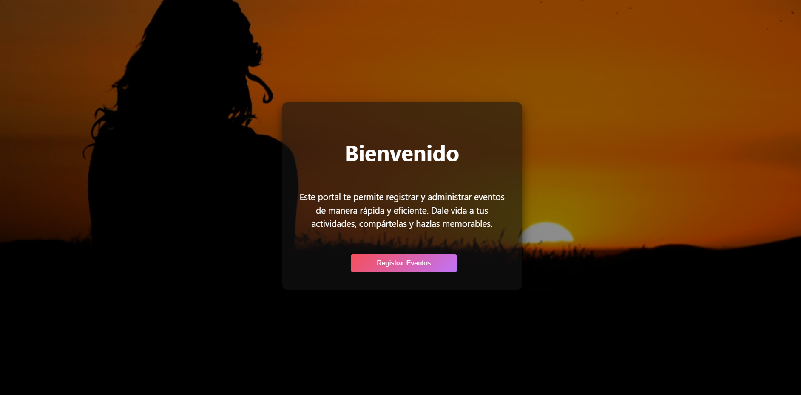
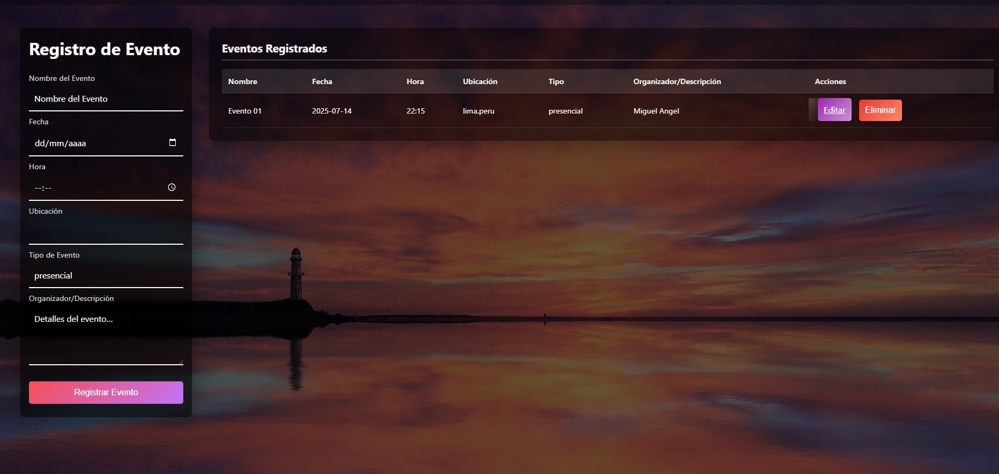

```md
# 🗓️ Registro de Eventos

Sistema web para gestionar y visualizar eventos importantes organizados por una institución o entidad.

---

## 🚀 Página de Inicio

**Ruta:** `/inicio/`

Desde aquí puedes acceder a la aplicación y comenzar a registrar tus eventos.



---

## ✍️ Página de Registro

En esta vista puedes ingresar nuevos eventos, ver la tabla de eventos existentes, y realizar acciones como editar o eliminar.




Pag Registro

---

## ⚙️ Funcionalidades Principales

- ✅ Registrar eventos con nombre, fecha, lugar y organizador.
- ✅ Visualizar todos los eventos registrados en una tabla.
- ✅ Editar o eliminar eventos desde la misma interfaz.
- ✅ Diseño responsivo y fácil de usar.

---

## 📂 Estructura del Proyecto

```

RegistroDeEventos/
├── eventos/
│   ├── templates/
│   │   └── eventos/
│   │       ├── inicio.html
│   │       └── registro.html
├── static/
│   └── css/
│       └── style.css
├── manage.py
└── README.md

```